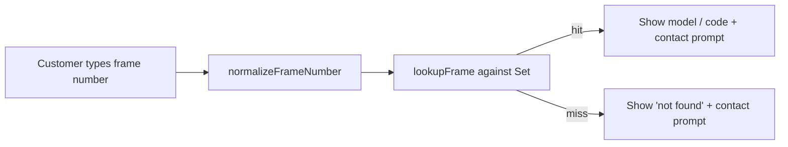

# Frame-number recall check

A small, dependency-free web tool that lets a customer type a bike frame number and instantly see whether it appears on a given list (for example, an affected-stock or recall list). The UI is in Norwegian ("011 Rammenummer-sjekk"); the code and this document are in English.

## Overview

- **Users:** customers checking a single frame number; a shop that maintains the list.
- **Core:** input is normalized (letters + digits only, upper-cased, leading-zero fallback for numeric input) and matched against a set of known frame numbers. Matching logic lives in a small, unit-tested module (`frame-utils.js`).
- **Frontend:** one static HTML page + CSS (no framework, no build step).

## How it works



`normalizeFrameNumber` and `lookupFrame` are pure functions in `frame-utils.js`, shared by the browser client (`script.js`) and the reference serverless endpoint (`api/check.js`), and covered by tests in `test/`.

## ⚠️ Privacy: the static version exposes the full list

The static client fetches `frames.json` in the browser, so **the entire list of frame numbers (and their model/code details) is downloadable by anyone** who opens the page — it is not private. `frames.json` in this repository currently contains real records (161 entries sourced from an inventory spreadsheet).

If that data is sensitive, do **not** rely on the static version. Two options:

1. **Serverless boolean API (recommended).** Deploy `api/check.js` (Vercel / Netlify Functions / Cloudflare Worker), keep the data server-side, and have the client POST the typed number and receive only `{ "found": true | false }`. No record details or full list ever reach the browser. The endpoint includes basic per-instance rate limiting.
2. **Keep the repository private** if the list itself must not be public.

GitHub Pages is static-only and cannot run `api/check.js`; use it only for the non-sensitive static version.

## Getting started

Static site — no build step. Serve the folder and open it:

```bash
python -m http.server 8000
# then open http://localhost:8000
```

`script.js` is an ES module, so it must be served over `http(s)://` (opening the file with `file://` will be blocked by the browser's module CORS rules).

### Configuration

- **Contact:** set `CONTACT_EMAIL` at the top of `script.js` to enable the "Kontakt oss" button. Left empty, the contact prompt renders as plain text (no broken link).
- **List:** replace `frames.json` (`{ "meta": {...}, "frames": { "<NUMBER>": { "description": "...", "code": "..." } } }`).

## Testing

```bash
npm test        # node --test, no dependencies
```

Covers normalization (spaces/symbols/case), empty input, exact match, the leading-zero fallback, and misses. Runs in CI (`.github/workflows/ci.yml`) on every push and PR.

## Accessibility

- Result region uses `aria-live="polite"`; the input has an associated (visually hidden) `<label>`; interactive controls are real `<button>`s with visible focus styles.
- Output is HTML-escaped (`escapeHtml`) to prevent injection from list data.

## Known limitations

- Static version is not private (see the Privacy section).
- `api/check.js` is a reference implementation; production use needs the data moved to a private store and a shared rate-limit backend.
- No fuzzy matching — only exact (normalized) and leading-zero-stripped matches.

## Project status

Working prototype. The static client is functional; the serverless API is provided as a reference design and is not deployed here.

## License

No license file is present; all rights reserved. Add a license if reuse is intended.
